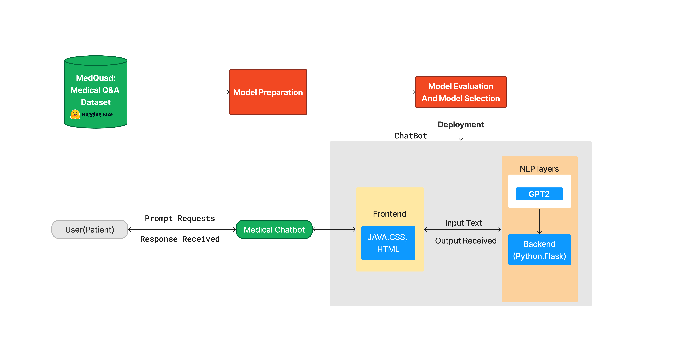
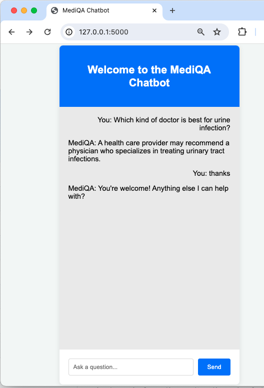
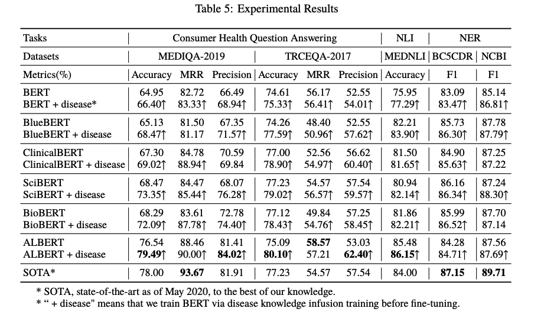
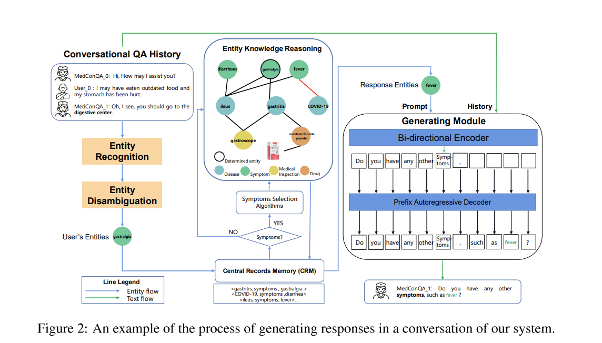

# Medical Chatbot for Patients
This repository details the development of a Medical Chatbot designed to provide patients with personalized and immediate access to medical information and services, utilizing AI and NLP techniques.

---
## Contents
- [Introduction](#introduction)
- [Problems and Solutions](#problems-and-solutions)
- [Motivation](#motivation)
- [Solution Requirements](#solution-requirements)
- [System Architecture (Framework)](#system-architecture-framework)
- [Methodology](#methodology)
  - [Data Collection and Preprocessing](#1-data-collection-and-preprocessing)
  - [Model Development](#2-model-development)
  - [Experimental Design](#3-experimental-design)
  - [Evaluation Metrics Scores](#evaluation-metrics-scores)
  - [Human Evaluation](#human-evaluation)
- [Deployment](#deployment)
- [Project Management](#project-management)
  - [Task Distribution](#task-distribution)
- [Dataset Information](#dataset-information)
- [Reference Papers](#reference-papers)

## Introduction
### Project Background
---
Medical chatbots, powered by AI technology, provide personalized and convenient access to medical information and services, acting as virtual assistants for users(patients). They offer immediate responses to inquiries, guidance on health issues and medication management. This chatbot utilizes NLP techniques and vast medical data to enhance precision, empower users to seek accurate medical advice, make informed decisions, and access reliable healthcare information efficiently.

---
## Motivation
---
By addressing the challenges mentioned, the chatbot aims to achieve the following objectives:
- Empower users to make informed decisions about their health and medical conditions, enhancing overall health literacy and promoting proactive healthcare management.
- Provide a convenient and efficient platform for users to access medical information anytime, anywhere, facilitating timely decision-making and intervention in healthcare matters.
This project will serve as a practical application of the concepts studied in the NLP course and reinforce our learning and showcasing the real-world relevance of the technologies and strategies employed in improving healthcare accessibility and patient outcomes.

---
## Problems and Solutions
---
### Problems
---
- Limited Access to Healthcare Professionals: Long wait times for appointments,overburdened healthcare systems, geographical barriers and financial constraints results in the limited access to healthcare professionals
- Delayed Medical Attention: Lack of awareness or understanding of the seriousness of symptoms contributes to delayed medical attention, especially in case of Cancer.
- Technological problems: Traditional chatbots were rule-based and had limited understanding of natural languages and inability to learn and adapt which resulted in limited accuracy.

---
### Solutions
---
The key factors to deploy medical chatbots include scalability, availability, data collection, instant information provision, and cost efficiency.
- Scalability: Efficiently handles increased demand without compromising quality
- Availability: Provides 24/7 instant support for patients
- Data Collection: Analyzes patient data for informed insights and personalized care
- Instant Information: Offers rapid and accurate responses to inquiries
- Cost Efficiency: Optimizes operations, reduces costs, and streamlines tasks

---
## Related Works

### 1. Buoy Health
---

Features: Buoy Health is a conversational AI chatbot designed to provide personalized health assessments and guidance to users. It uses natural language processing to understand users' symptoms, medical history, and concerns, and then offers tailored recommendations such as possible conditions, next steps, and self-care advice. Buoy Health aims to empower users to make informed decisions about their health and navigate the healthcare system more effectively.
Objectives: The primary objective of Buoy Health is to improve healthcare access and outcomes by leveraging AI technology to deliver accurate and reliable health information and support to users. It aims to reduce unnecessary healthcare visits, alleviate patient anxiety, and facilitate early detection and management of medical conditions.
NLP Architecture: Buoy Health employs a combination of NLP techniques, including rule-based systems, machine learning models, and medical knowledge graphs. It uses advanced algorithms to analyze user input, extract relevant information, and match symptoms to potential conditions. The architecture may include components such as named entity recognition (NER), intent classification, and dialogue management systems.

---
### 2. Ada Health

Features: Ada Health is an AI-driven health assessment platform that offers personalized symptom analysis and health advice through conversational interactions. Users can describe their symptoms to Ada, and the chatbot will ask relevant questions to gather more information and provide possible explanations and recommendations. Ada Health aims to empower individuals to manage their health proactively and seek appropriate medical care when needed.
Objectives: The main objective of Ada Health is to democratize access to healthcare by leveraging AI technology to deliver comprehensive and reliable health assessments and recommendations to users worldwide. It aims to augment healthcare services, improve health literacy, and promote early intervention and prevention of diseases.
NLP Architecture: Ada Health utilizes a sophisticated NLP architecture consisting of deep learning models, probabilistic algorithms, and medical knowledge bases. It employs techniques like natural language understanding (NLU), sentiment analysis, and probabilistic reasoning to interpret user input, generate hypotheses, and provide personalized health insights. The architecture may incorporate pretrained language models, medical ontologies, and domain-specific knowledge graphs to enhance accuracy and relevance.

---
## Gap Between Related Work

The existing landscape of chatbots available on the market predominantly revolves around facilitating interactions based on users' medical history. These chatbots excel in managing and tracking users' existing medical conditions, enabling communication with healthcare providers, and aiding in the coordination of care based on past medical records. While these functionalities are invaluable for personalized healthcare management, they often fall short in addressing broader aspects of healthcare, such as medical health literacy, accurate diagnosis of new symptoms, and providing reliable information for diverse medical queries.

In contrast, our medical chatbot for patients is designed to fill this crucial gap by focusing on enhancing users' medical health literacy, providing accurate diagnoses, and addressing a wide range of medical queries beyond historical data. We have leveraged advanced language understanding and generation models, such as Seq2Seq and GPT-2, to develop a conversational chatbot capable of comprehensively addressing users' medical-related concerns. Through the integration of advanced language models, we strive to deliver a user-friendly and intelligent conversational interface that enhances health literacy, supports accurate diagnosis, and fosters proactive healthcare management.

---
## Solution Requirements

- Utilize advanced NLP for accurate comprehension of user queries and responses.
- Integrate with a constantly updated medical knowledge base.
- Conduct trials to identify the most effective model.
- Ensure smooth integration with a web application
- Offer a user-friendly interface to increase user satisfaction.

---
## System Architecture (Framework)

## Dataset Information

We have used the MedQuad dataset from : 

- HuggingFace Dataset: [https://huggingface.co/datasets/keivalya/MedQuad-MedicalQnADataset](https://huggingface.co/datasets/keivalya/MedQuad-MedicalQnADataset)

--- 
## Methodology
### 1. Data Collection and Preprocessing

#### Datasets
- Sources: Leverage the MedQuad dataset and supplementary datasets from Huggingface and GitHub.

#### Data Preprocessing 
- We have used the GPT2TokenizerFast from the transformers library to tokenize text efficiently for processing with the GPT-2 model.
- Similarly, for the seq2seq model, we’re using NLTK library for carrying out the tokenization.
- Dataset is further splitted into training, validation and testing pairs on 80%, 10%, and 10% respectively

### 2. Model Development

- We have trained 2 models: Seq2Seq and GPT2.
- Integrate advanced NLP techniques like validation and perplexity,adaptation validation seq2seq for high quality performance.

### 3. Experimental Design

We conducted experiments to train and fine-tune two models, namely GPT-2 and Seq2Seq, for medical question-answering (QA) tasks. Below are the details of the experimental design and hyperparameters used for each model:

#### a. GPT-2 Model:
- Training Data: We utilized a dataset consisting of 143,250 samples for training the GPT-2 model.
- Fine-tuning: The GPT-2 model was fine-tuned on medical QA data to adapt it specifically for medical-related inquiries.
Hyperparameters for Fine-Tuning:
- Evaluation Strategy: Epoch-based evaluation
- Learning Rate: 2e-5
- Weight Decay: 0.01
- Number of Training Epochs: 3

#### b. Seq2Seq Model:
-Training Data: Similar to the GPT-2 model, we used the same dataset containing 143,250 samples for training the Seq2Seq model.
Hyperparameters:
- Hidden Layers: 512
- Number of Iterations: 15,000
- Teacher Forcing Ratio: 0.5
- Learning Rate Encoder: 0.0001
- Learning Rate Decoder: 0.0005
- Optimizer: Adam Optimizer

Both models were trained using these hyperparameters to optimize their performance for medical question-answering tasks. The choice of hyperparameters was based on experimentation and empirical observations to achieve a balance between model complexity, training efficiency, and task-specific requirements. Additionally, the evaluation strategy for both models involved monitoring performance metrics such as accuracy, loss, and convergence over the specified number of training epochs.

### 4. Evaluation

- Apply a suite of metrics, including BLEU, ROGUE.
- Expand evaluation to include precision, recall, and F1-score to gauge the relevance and accuracy of medical advice.

### 5. Result

From comparing the results between the GPT-2 and Seq2Seq models using various evaluation metrics, including BLEU, ROUGE, precision, recall, and F1-score, we observed the following outcomes:

##### GPT-2 Model:
- Achieved better scores across multiple evaluation metrics.
- Demonstrated decent performance overall.
- Showed relatively better human evaluation results compared to the automated metrics.

##### Seq2Seq Model:
- Displayed a decent performance but was outperformed by the GPT-2 model in most evaluation metrics.
- While it produced acceptable results, it did not achieve the same level of effectiveness as the GPT-2 model.
- Human evaluation revealed lower satisfaction compared to the GPT-2 model, suggesting limitations in generating relevant and accurate medical advice.

Overall, the GPT-2 model exhibited better performance across various evaluation metrics, indicating its superiority in generating paraphrases and providing medical advice with higher relevance and accuracy. The Seq2Seq model, while performing decently, fell short in comparison to the GPT-2 model, particularly in terms of human evaluation and certain automated metrics.

## Evaluation Metrics Scores

| SN | Metric | Seq2Seq | GPT2 |
|----|-------|----------|----------|
| 1 | BLUE Score | 0.1875| 0.3056 |
| 2 | ROUGE Score| 0.4170 | 0.3934|
| 3 | Precision  | 0.2648 | 0.3647 |
| 4 | Recall| 0.1485| 0.2485 |
| 5 | F1-Score | 0.1723| 0.2723 |

### 1. BLUE Score:
- The BLUE (Bilingual Evaluation Understudy) score measures the similarity between the generated text and human reference text.
- The Seq2Seq model achieves a BLUE score of 0.1875, indicating moderate similarity.
- In contrast, the GPT2 model achieves a higher BLUE score of 0.3056, indicating closer similarity to human reference text compared to Seq2Seq.

### 2. ROUGE Score:
- The ROUGE (Recall-Oriented Understudy for Gisting Evaluation) score assesses the overlap between the generated text and human reference text in terms of n-grams.
- The Seq2Seq model achieves a ROUGE score of 0.4170, indicating a relatively high overlap.
- However, the GPT2 model's ROUGE score is slightly lower at 0.3934, suggesting a slightly lower overlap with the reference text compared to Seq2Seq.

### 3. Precision:
- Precision measures the proportion of relevant information in the generated text.
- The Seq2Seq model achieves a precision score of 0.2648, indicating that about 26.48% of the generated text is relevant.
- In contrast, the GPT2 model achieves a higher precision score of 0.3647, indicating that about 36.47% of the generated text is relevant, which is notably higher than Seq2Seq.

### 4. Recall:
- Recall measures the proportion of relevant information in the reference text that is captured by the generated text.
- The Seq2Seq model achieves a recall score of 0.1485, indicating that about 14.85% of relevant information from the reference text is captured.
- The GPT2 model achieves a higher recall score of 0.2485, indicating that about 24.85% of relevant information from the reference text is captured, which is notably higher than Seq2Seq.

### 5. F1-Score:
- The F1-score is the harmonic mean of precision and recall, providing a balanced measure of both metrics.
- The Seq2Seq model achieves an F1-score of 0.1723.
- However, the GPT2 model achieves a higher F1-score of 0.2723, indicating better overall performance in terms of both precision and recall compared to Seq2Seq.

In summary, while the Seq2Seq model may excel in certain metrics like ROUGE score, the GPT2 model generally outperforms it across most metrics, including precision, recall, and F1-score, indicating its superior ability to generate text that closely resembles human-written text and captures relevant information from the reference text.

## Human Evaluation
| Category             | Rating (1-5) | Definitions and Criteria                                                                                                   |
|----------------------|--------------|----------------------------------------------------------------------------------------------------------------------------|
| Medical Accuracy     | 1-5          | 1 (Poor): Consistently incorrect, misleading. 2 (Fair): Often inaccurate, lacks detail. 3 (Average): Generally accurate, some errors. 4 (Good): Mostly accurate, minor inaccuracies. 5 (Excellent): Highly accurate, detailed, fully reliable. |
| Guideline Adherence | 1-5          | 1 (Poor): Ignores clinical guidelines. 2 (Fair): Struggles with guidelines, frequent errors. 3 (Average): Generally follows guidelines. 4 (Good): Consistently adheres to guidelines. 5 (Excellent): Perfect adherence, no exceptions. |
| Clarity              | 1-5          | 1 (Poor): Very confusing, unclear. 2 (Fair): Somewhat understandable, uses complex jargon. 3 (Average): Clear with occasional complex language. 4 (Good): Very clear, minimal jargon. 5 (Excellent): Exceptionally clear, straightforward. |
| Empathy              | 1-5          | 1 (Poor): Completely detached, inappropriate. 2 (Fair): Limited empathy, often seems indifferent. 3 (Average): Shows basic empathy, somewhat supportive. 4 (Good): Very empathetic and supportive. 5 (Excellent): Exceptionally empathetic, always supportive. |
| Response Relevance   | 1-5          | 1 (Poor): Responses mostly irrelevant or off-topic. 2 (Fair): Often irrelevant or slightly off-topic. 3 (Average): Mostly relevant, some off-topic responses. 4 (Good): Highly relevant, consistently on-topic. 5 (Excellent): Always relevant, perfectly on-topic. |

| Category             | Rating (1-5) | Evaluator Comments (Doctors' Feedback)                                                                                               |
|----------------------|--------------|---------------------------------------------------------------------------------------------------------------------------------------|
| Medical Accuracy     | 2            | "Frequently inaccurate or overly generic, lacking specific medical detail."                                                          |
| Guideline Adherence | 2            | "Often fails to follow clinical guidelines, especially in complex cases."                                                            |
| Clarity              | 3            | "Responses are understandable but sometimes use jargon that could confuse patients."                                                   |
| Empathy              | 2            | "Struggles to convey genuine empathy, often comes off as detached."                                                                   |
| Response Relevance   | 2            | "Irrelevant or off-topic responses are common, particularly in nuanced discussions."                                                   |

## Deployment
### Chat Interface Functionality

- Allows users to ask questions, send them, and receive responses from the chatbot.
- Messages are displayed in a visually distinct format, with user messages on the right and bot responses on the left.

 

### Demo Video

Click the image below to watch a demo of the Medical Chatbot in action. The video demonstrates key features and functionalities, showcasing how users can interact with the chatbot to receive personalized medical advice.

This demo provides a visual guide to the capabilities of our chatbot, illustrating its user-friendly interface and how it processes and responds to various user queries.

---

## Project Management
### Task Distribution
| SN | Tasks | Subtasks | Assignee |
|----|-------|----------|----------|
| 1 | Data Collection | Research/Background study for data selection | Sonu & Ashmita |
| | | Data Cleansing | Haneesha & Shafi |
| 2 | Data Preprocessing | Tokenization/Numericalization | Tanzil & Haneesha |
| 3 | Research on Models | Research | All team members |
| 4 | Model Selection and Training | Experiment with different models | Ashmita & Shafi |
| 5 | Evaluation | | Sonu & Tanzil |
| 6 | Frontend/Backend | | Haneesha & Ashmita |
| 8 | Integration/Testing | | Shafi & Tanzil |
| 9 | Deployment | | Shafi & Shafi |
| 10 | Documentation | | Tanzil & Ashmita |

---

## Reference Papers 
1. [Sonu Adhikari](#sonu-adhikari)
    - [MedConQA: Medical Conversational Question Answering System based on Knowledge Graphs](#medconqa-medical-conversational-question-answering-system-based-on-knowledge-graphs)
    - [Evaluation of the Clinical Question Answering Presentation](#evaluation-of-the-clinical-question-answering-presentation)
  
2. [Ashmita Phuyal](#ashmita-phuyal)
    - [Incorporating Medical Knowledge in BERT for Clinical Relation Extraction](#incorporating-medical-knowledge-in-bert-for-clinical-relation-extraction)
    - [Infusing Disease Knowledge into BERT for Health Question Answering, Medical Inference, and Disease Name Recognition](#infusing-disease-knowledge-into-bert-for-health-question-answering-medical-inference-and-disease-name-recognition)
  
3. [Tanzil Al Sabah](#tanzil-al-sabah)
    - [How You Ask Matters: The Effect of Paraphrastic Questions to BERT Performance on a Clinical SQuAD Dataset](#how-you-ask-matters-the-effect-of-paraphrastic-questions-to-bert-performance-on-a-clinical-squad-dataset)
    - [Answering Clinical Questions with Role Identification](#answering-clinical-questions-with-role-identification)
  
4. [Md Shafi Ud Doula](#md-shafi-ud-doula)
    - [Infusing Disease Knowledge into BERT for Health Question Answering, Medical Inference, and Disease Name Recognition](#infusing-disease-knowledge-into-bert-for-health-question-answering-medical-inference-and-disease-name-recognition)
    - [MedConQA: Medical Conversational Question Answering System](#medconqa-medical-conversational-question-answering-system)

5. [Sai Haneesha Bestha](#sai-haneesha-bestha)
    - [Recognizing Question Entailment (RQE) and Natural Language Inference (NLI) methods](#recognizing-question-entailment-rqe-and-natural-language-inference-nli-methods)
    - [Fine-Tuning PEGASUS for Consumer Health Question Summarization](#fine-tuning-pegasus-for-consumer-health-question-summarization)

---
### Sonu Adhikari
#### MedConQA: Medical Conversational Question Answering System based on Knowledge Graphs
- **Link:** [https://aclanthology.org/2022.emnlp-demos.15/](https://aclanthology.org/2022.emnlp-demos.15/)
- **Summary:** Conversational Question Answering is the natural evolution of traditional question answering systems. It can improve the experience by providing the natural flow of conversation. 
There are several problems with existing systems like Single reply function and difficult to scale,Rule-based systems are monotonous and lack expertise,Ensuring a safe and controllable response is also a challenge since medical is a sensitive domain.The MedConQA implements pipeline manner for automating medical procedures. Multiple modules are integrated into the system such as medical consultation, medical triage, drug recommendation etc. Several advanced technologies such as medical entity disambiguation and response generation. It is competitive compared to other SOTA technologies in the medical dialogue system.
The preliminary experiment has been carried out in a hospital in China. The whole process includes symptom consultation and triage, disease confirmation and dialogue generation.
CMCQA https://github.com/WENGSYX/CMCQA?tab=readme-ov-file  and CMKG https://github.com/WENGSYX/CMKG?tab=readme-ov-file data has been used. The model has been trained using Pytorch and Hugging Face framework. During training, adamW optimiser has been used. The Learning rate is 1e-5 with warm-up. Similarly, Four 3090 GPUs have been used.For evaluation, both automatic and human evaluation has been used in this paper. The Evaluation metrics used are F1, BLEU, Dist. scores ( F1- reflects correctness of medical entity knowledge,BLEU - relativity of generated responses, Dist. score - diversity of the generated responses).For human evaluation, 100 samples from test datasets have been randomly picked.Each generated sentence is scored from 1 to 5(1 being the worst) by three independent people with medical background. Results from the evaluation demonstrate the effectiveness of the proposed system in addressing the identified limitations. The paper concludes by highlighting the significance of MedConQA in improving medical dialogue systems and providing resources such as code, datasets, and tools to advance future research in this area.
Application website: https://www.chunyuyisheng.com/pc/doctor/clinic_web_a8d7e183365b2224/

#### Evaluation of the Clinical Question Answering Presentation
- **Link:** [https://aclanthology.org/W09-1322.pdf](https://aclanthology.org/W09-1322.pdf)
- **Summary:** 
The paper focuses on evaluating the effectiveness of two presentation methods, namely the sentence-based approach and the passage-based approach, within an online clinical question answering system called AskHERMES. The goal is to determine which approach provides better context and coherence for answering clinical questions. The introduction highlights the importance of efficiently presenting answers to meet the information needs of users, particularly in the biomedical field where questions are often complex and require comprehensive responses. The background section provides insight into the challenges faced by existing search engines and question answering systems, emphasizing the need for more adaptable and comprehensive approaches, especially in the biomedical domain.
The passage-based approach, which returns ranked passages instead of sentences, is proposed as a potential solution to provide richer context and improve the relevance of answers. The evaluation design outlines the criteria for assessing the effectiveness of both approaches, including the handling of hard and failed questions.The evaluation results indicate that while the sentence-based approach may work well for simple questions, the passage-based approach generally offers richer context and coherence, making it more effective for complex clinical queries. However, limitations are identified, particularly regarding semantic boundaries and passage length.Overall, the research underscores the importance of context in enhancing answer quality for complex clinical queries and highlights the potential of the passage-based approach in addressing these challenges.

---

### Ashmita Phuyal

#### Incorporating Medical Knowledge in BERT for Clinical Relation Extraction
- **Link:** [https://aclanthology.org/2021.emnlp-main.435/](https://aclanthology.org/2021.emnlp-main.435/)
- **Summary:** The research paper explores enhancing pre-trained language models like BERT for clinical relation extraction by incorporating medical knowledge. It addresses the challenge of adapting general-domain models to domain-specific tasks, such as extracting clinical relations, which require additional medical understanding. By integrating medical knowledge into BERT, the researchers achieved superior performance on the i2b2/VA 2010 clinical relation extraction dataset, surpassing existing systems. The study focuses on optimizing BERT for clinical tasks by infusing medical knowledge, showcasing improved performance in specific clinical applications.

#### Infusing Disease Knowledge into BERT for Health Question Answering, Medical Inference, and Disease Name Recognition
- **Link:** [https://aclanthology.org/2020.emnlp-main.372/](https://aclanthology.org/2020.emnlp-main.372/)
- **Summary:** The research paper titled "Infusing Disease Knowledge into BERT for Health Question Answering, Medical Inference, and Disease Name Recognition" explores enhancing pre-trained language models like BERT with disease-specific knowledge to improve health-related and biomedical tasks. The study integrates BERT with disease knowledge to enhance tasks such as consumer health question answering, medical language inference, and disease name recognition. By proposing a new disease knowledge infusion training procedure and evaluating it across various BERT models like BioBERT, SciBERT, ClinicalBERT, BlueBERT, and ALBERT, the researchers demonstrated significant improvements in model performance. For example, BioBERT's accuracy in consumer health question answering increased from 68.29% to 72.09%, with new state-of-the-art results achieved in two datasets. The study was presented at the 2020 Conference on Empirical Methods in Natural Language Processing and published by the Association for Computational Linguistics

---
### Tanzil Al Sabah

#### How You Ask Matters: The Effect of Paraphrastic Questions to BERT Performance on a Clinical SQuAD Dataset
- **Link:** [https://aclanthology.org/2020.clinicalnlp-1.13.pdf](https://aclanthology.org/2020.clinicalnlp-1.13.pdf)

**Summary:** This paper explores the significant impact that paraphrastic questioning has on the performance of BERT in clinical question-answering tasks. By delving into how the phrasing of questions affects BERT's ability to deliver accurate responses, the research highlights the necessity of diverse question phrasing in improving NLP model efficacy in the medical field.

#### Key Insights

- **Variability in Question Phrasing**: Demonstrates that BERT's answer accuracy benefits from training on a diverse array of question phrasings.
- **Experimental Approach**: Employs a clinical QA dataset, training BERT models with both pooled question variants and individual question constructs, showing that the pooled approach yields superior performance.
- **Importance for Clinical QA Systems**: Indicates that integrating a broad range of question phrasings during training significantly boosts the model's adaptability and accuracy in clinical contexts.

#### Practical Implications

- **Model Training Enhancement**: Advises the incorporation of paraphrastic question variations into the training datasets of NLP models for clinical use, aiming to create more accurate and robust QA systems.
- **Clinical Decision Support Improvement**: The insights provided by the study can facilitate the development of more effective clinical decision support tools by ensuring that models are better equipped to address varied user inquiries.
- **Future Research Directions**: Encourages additional research into training techniques or models that more effectively accommodate paraphrastic variations in language.

This research underscores the pivotal role of question paraphrasing in the success of NLP models for clinical question answering. It provides valuable insights for advancing the development of clinical decision support tools that are both responsive and reliable.

#### Answering Clinical Questions with Role Identification
- **Link:** [https://aclanthology.org/W03-1310.pdf](https://aclanthology.org/W03-1310.pdf)

**Summary:**  This paper delves into the natural language analysis in medical question-answering within the broader scope of a medical text-retrieval project, emphasizing the challenges unique to the medical domain for general question-answering systems. The authors propose an alternative approach centered around the identification of semantic roles in both question and answer texts, correlating with the PICO format fields.

#### Motivation

The need for quick access to existing medical evidence during patient treatment is crucial. The practice, known as Evidence-Based Medicine (EBM), involves using the best current evidence to make informed decisions about patient care. However, the success of EBM hinges on the speed of accessing this information.

#### The EPoCare Project

The EPoCare (Evidence at Point of Care) project aims to provide clinicians with fast access to medical information at the point of care. The project's interdisciplinary collaboration spans Industrial Engineering, Cognitive Psychology, Knowledge Management, Natural Language Processing, and Health Informatics. The system, currently based on keyword queries, aims to evolve to accept natural language questions and better identify answers from its natural-language data sources.

#### System Architecture

The EPoCare system comprises two main components: an XML document database storing data sources and the EPoCare server, which utilizes this database to answer queries. The current system operates on PICO-format queries but is limited in representing the full semantics of natural-language questions.

#### Challenges in Medical QA

The authors highlight significant differences between general QA (GQA) and medical QA (MQA) across several dimensions, including question processing, question-answer matching, and answer extraction. In particular, the medical domain presents unique challenges such as the need for domain-specific knowledge bases (e.g., UMLS), the importance of named entity identification, and the necessity to consider the context in which candidate answers are found.

#### Locating Answers by Role Identification

The paper advocates for a role-based method in MQA, identifying roles represented by the PICO format in both the question and candidate answer texts. This approach aims to overcome the limitations of current information-extraction techniques by providing a more flexible and accurate means of matching questions to answers.

#### Conclusion

The work in progress reported in this paper analyzes the limitations of GQA technologies in MQA and introduces techniques based on semantic role identification. Although still in the early stages, this approach promises to enhance the accuracy and completeness of answers provided by the EPoCare system to clinical queries.

#### Acknowledgements

The EPoCare project is supported by grants from Bell University Laboratories at the University of Toronto and the Natural Sciences and Engineering Research Council of Canada.

---

### Md Shafi Ud Doula
#### Infusing Disease Knowledge into BERT for Health Question Answering, Medical Inference, and Disease Name Recognition

#### Overview

In "Infusing Disease Knowledge into BERT for Health Question Answering, Medical Inference, and Disease Name Recognition," Yun He, Ziwei Zhu, Yin Zhang, Qin Chen, and James Caverlee propose an innovative approach to enhance the BERT model's performance by incorporating disease-specific knowledge. This paper, presented at the EMNLP 2020 conference, marks a significant step forward in applying pre-trained language models to the biomedical field.

**Authors:** Yun He, Ziwei Zhu, Yin Zhang, Qin Chen, James Caverlee  
**Affiliations:** Texas A&M University, College Station, USA; Fudan University, Shanghai, China  
**Published In:** Proceedings of the 2020 Conference on Empirical Methods in Natural Language Processing (EMNLP 2020)  
**Paper Link:** [Infusing Disease Knowledge into BERT](https://aclanthology.org/2020.emnlp-main.372.pdf)

#### Key Contributions

1. **Introduction of Disease Knowledge Infusion:** A novel training method that integrates symptoms, diagnoses, and treatment information into BERT models, aiming to improve their understanding of disease-related queries.

2. **Comprehensive Evaluation:** The study rigorously evaluates the efficacy of disease knowledge-infused BERT models (including BioBERT, SciBERT, ClinicalBERT, BlueBERT, and ALBERT) across diverse health-related tasks and datasets.

3. **Significant Performance Gains:** Showcases notable improvements in accuracy and establishes new benchmarks in tasks such as consumer health question answering, medical language inference, and disease name recognition.

#### Methodology

#### Disease Knowledge Infusion Training

- **Auxiliary Sentence Construction:** Enhances model training by generating sentences that encapsulate disease and aspect information, facilitating deeper semantic understanding.

- **Leveraging Wikipedia for Weak Supervision:** Employs Wikipedia's structured data as a source for weakly-supervised learning, capitalizing on its vast repository of disease information.

#### Results

- **Benchmarking Success:** The infusion of disease knowledge notably increases the accuracy of models like BioBERT on health question answering tasks, pushing the boundary to new state-of-the-art levels.

- **Across-the-Board Improvements:** Consistent performance boosts across various models and tasks validate the effectiveness of the proposed infusion technique.

#### Impact and Future Work

This research highlights the significant potential of incorporating domain-specific knowledge into language models for biomedical applications. It paves the way for future studies focused on refining knowledge infusion methods and exploring their broader applicability.

#### References

- Devlin, J., et al. (2019). *BERT: Pre-training of deep bidirectional transformers for language understanding*.
- Lee, J., et al. (2020). *BioBERT: a pre-trained biomedical language representation model for biomedical text mining*.
- Rogers, A., et al. (2020). *A primer in BERTology: What we know about how BERT works*.

*This literature review synthesizes key points from "Infusing Disease Knowledge into BERT for Health Question Answering, Medical Inference, and Disease Name Recognition" by Yun He et al., emphasizing the advancement in biomedical NLP tasks.*

#### MedConQA: Medical Conversational Question Answering System

#### Overview
The paper presented at the 2022 Conference on Empirical Methods in Natural Language Processing: System Demonstrations introduces an advanced conversational QA system tailored for medical triage, diagnosis confirmation, and treatment recommendations. This demonstration highlights the integration of medical entity recognition, entity disambiguation, and entity knowledge reasoning within a dialogue system, aiming to streamline the patient-doctor interaction process.

- **Authors:** Fei Xia, bin Li, Yixuan Weng, Shizhu He, Kang Liu, Bin Sun, Shutao Li, Jun Zhao
- **Affiliations:** School of Artificial Intelligence, University of Chinease Acamedy of Sciences; College of Electrical & Information Engineering, Hunan University
- **Published In:** Proceedings of the 2022 Conference on Empirical Methods in Natural Language Processing: System Demonstrations
- **Paper Link:** [https://aclanthology.org/2022.emnlp-demos.15.pdf](https://aclanthology.org/2022.emnlp-demos.15.pdf)

#### Key Contributions
1. **Advanced Conversational QA System:** Showcases a sophisticated QA system designed for medical consultations, enhancing the efficiency and accuracy of patient care.
2. **Entity Knowledge Integration:** Implements a robust framework for 
- medical entity recognition, 
- disambiguation, and 
- knowledge reasoning, facilitating precise medical advice.

3. **Interactive Dialogue Generation:** Employs state-of-the-art NLP techniques to generate interactive and contextual dialogues between patients and the medical QA system.

#### Methodology
#### Entity Knowledge Reasoning and Dialogue Generation
- The system incorporates entity flow and text flow mechanisms to process medical dialogue history, employing algorithms for symptom selection and generating contextual responses.

- Uses a Bi-directional Encoder and Prefix Autoregressive Decoder for generating medical consultations that accurately address patient queries and symptoms.

#### Results
- The conversational medical QA system demonstrates high levels of fluency and correctness in generating dialogue, as assessed by medical professionals.

- Statistical evaluation of dialogues shows strong patient satisfaction and accuracy in symptom identification and drug recommendations.

#### Impact, Limitation & Future Work
The research opens new avenues for applying conversational AI in healthcare, offering a scalable solution for medical consultations. Future work will focus on expanding the system's medical knowledge base and improving its adaptability to diverse medical scenarios.

---

### Sai Haneesha Bestha
#### Recognizing Question Entailment (RQE) and Natural Language Inference (NLI) methods
- **Links:** 
  - [https://aclanthology.org/W19-5041.pdf](https://aclanthology.org/W19-5041.pdf)

**Summary:** The study integrates Recognizing Question Entailment (RQE) and Natural Language Inference (NLI) methods to enhance medical question answering systems, improving candidate response filtering and reranking accuracy. A multi-task learning system leverages features from NLI and RQE models to jointly learn filtering and reranking of candidate answers, outperforming feature-engineered baselines. The study demonstrates significant accuracy improvements in both filtering and reranking with the inclusion of NLI and RQE characteristics.

**Limitations:** Lexical Overlap Bias,Difficulty in Differentiating the neutral and entail statements,Computationally Expensive Approach,Performance Variability.

#### Fine-Tuning PEGASUS for Consumer Health Question Summarization
 **Links:** 
  - [https://aclanthology.org/2021.bionlp-1.37.pdf](https://aclanthology.org/2021.bionlp-1.37.pdf)

**Summary:** The study develops a model for CHQ summarization in MEDIQA 2021, aiming to streamline automated question answering by addressing extraneous information. It employs an ensemble method merging question focus identification with PEGASUS for concise summaries. Various preprocessing techniques enhance performance, achieving an 11.14% ROUGE-2 F-measure against the test dataset.

**Limitations:** Performance Improvement,Dataset Limitations,Preprocessing Challenges,Question Understanding.
